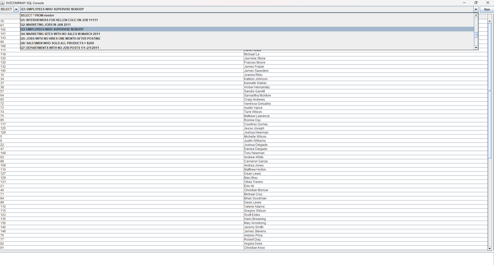
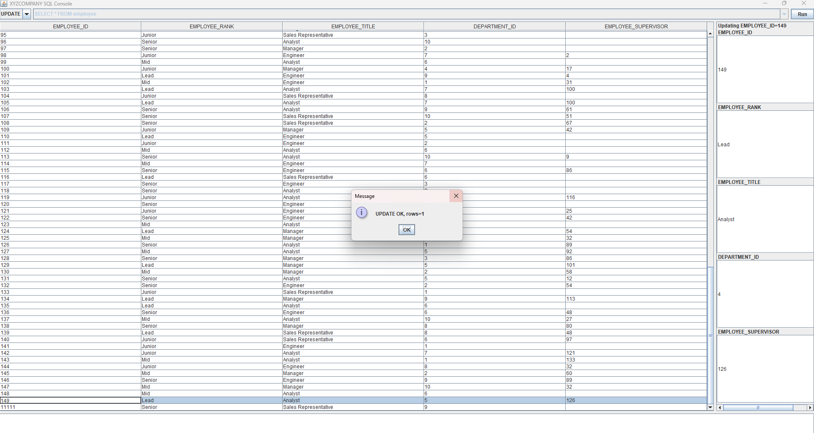

## XYZCOMPANY RDBMS & Query Java Console

This project is for CS 4347 Database Systems Course

A full‑stack mini–information‑system for a mid‑sized manufacturing firm:

|Layer|Technology|Purpose|
|---|---|---|
|Data|**MySQL 8**|3‑NF schema, declarative constraints, business‑rule triggers|
|Seeding|**Python 3 (Faker + PyMySQL)**|Generates ~500 persons, HR, sales & procurement sample data|
|App|**Java 17 Swing + JDBC**|Cross‑platform console to explore tables, 15 canned analytics queries & ad‑hoc SQL|
|Demo|**PHP 8** (optional)|Shows vulnerable vs. parameterized code for SQL‑injection awareness|

**Key features**  
• 30 tables, 4 views, 8 triggers, 15 graded project queries  
• Rich ER / EER / logical diagrams (PDFs in `docs/`)  
• Auto‑computed customer “preferred rep” & age/shift/site guards  
• Prepared‑statement vs. vulnerable PHP examples for classroom demos
### Prerequisites

| Tool           | Version (tested)                      |
| -------------- | ------------------------------------- |
| Java JDK       | 17 + (24 works)                       |
| MySQL Server   | 8.x (v8-compatible)                   |
| Python         | 3.8 + with pymysql and faker          |
| Connector/J    | 9.3.0 (`mysql-connector-j-9.3.0.jar`) |
| PHP (optional) | 8.4 + with `mysqli`, `pdo_mysql`      |

---

## 1 · Create the Schema

```sql
# start the server first, then:
# From a MySQL client (Workbench or CLI), run the provided PROJECT CODE.sql file to create XYZCOMPANY and all tables, views, triggers:
SOURCE path/to/PROJECT CODE.sql;
```

That script builds database `XYZCOMPANY`, users, tables, views and triggers

---

## 2 · Seed Sample Data (Python DML)

```bash
python -m venv venv
# Windows: venv\Scripts\activate
source venv/bin/activate
pip install pymysql faker

# edit creds in sql_project_initial_dml.py if needed
python sql_project_initial_dml.py
```

   The seeder populates every table and exercises the business‑rule triggers.

---

## 3 · Launch the Java Query Console

```bash
# put mysql-connector-j-9.3.0.jar in lib/
javac -d bin -cp "lib\mysql-connector-j-9.3.0.jar" src\SQLConsole.java
java -cp "bin;lib\mysql-connector-j-9.3.0.jar" SQLConsole
```

The Swing UI lists **SELECT** for every table, 4 views, and the 15 project queries; 
	Any **SELECT** in dropdown displays entire table, view or query
	





**INSERT** to add a custom entity to any table, tables are listed in dropdown menu
	If INSERT is accepted by SQL, message will be displayed to notify user, else an error message will be displayed
	User can insert into any table

")

")

**UPDATE** any table provided user knows the primary key of the table
	User is prompted for PK, and upon successful PK, can view all attributes of that entity
	User can update one or more attributes and will receive a message with the result of their UPDATE


")




**DELETE** any row in table with primary key
	User receives message with status of DELETE


Choose **Custom SQL…** for anything else.

---

## 4 · (Optional) SQL‑Injection Demo

```bash
cd demos/php_injection
php -S localhost:8000
# browse to http://localhost:8000/index.html
```

The `safe_*.php` files use prepared statements; the `*_vuln.php` files do not.

### Directory

```
docs/                 ER_MODEL.pdf, EER_MODEL.pdf, LOGICAL_MODEL.pdf,
/                     DEPENDENCY_DIAGRAM.svg, PROJECT INFO.pdf, QUERY RESULTS.pdf
sql/                  PROJECT CODE.sql
python/               sql_project_initial_dml.py
java/src/             SQLConsole.java
java/lib/             mysql-connector-j-9.3.0.jar
java/bin/             java class files
demos/php_injection/  index.html, select.php, safe_select.php, …
README.md             
```

### Troubleshooting

| Symptom                        | Fix                                                                                                                      |
| ------------------------------ | ------------------------------------------------------------------------------------------------------------------------ |
| `No suitable driver`           | Connector/J not on class‑path<br>Ensure `com.mysql.cj.jdbc.Driver` is on the class-path (the Connector/J JAR).           |
| `Access denied`                | Verify user `xyzcompany` / `projectcode` & host rights<br>Check your JDBC URL, username/password                         |
| Seeder fails                   | MySQL running? correct host/port in `sql_project_initial_dml.py`?<br>MySQL server is running and listening on port 3306. |
| PHP `Class "mysqli" not found` | Enable extensions in `php.ini`, restart server                                                                           |


# SQL-Injection Demo for XYZCOMPANY

This mini-project shows:
1. A **vulnerable** SELECT form (`select.php`)
2. A **safe** SELECT form using prepared statements (`safe_select.php`)
3. A **vulnerable** UPDATE form (`update.php`) and its safe counterpart (`safe_update.php`)

---

##  Prerequisites

1. **MySQL Server**  
   - Database: `XYZCOMPANY`  
   - User: `xyzcompany` / Password: `projectcode`  
   - Make sure you’ve loaded and populated the schema with `sql_project_initial_dml.py` (or via Workbench) before running the PHP demo.

2. **PHP 8.4+** (Windows installer from [php.net](https://windows.php.net/download/))  
   - During install, select **Thread-Safe** build for CLI and enable the **mysqli** and **pdo_mysql** extensions in your `php.ini`:
	ini
    extension=mysqli
    extension=pdo_mysql
     ```
   - Make sure `C:\php` (or wherever you installed) is on your **PATH**, or always call `C:\php\php.exe`.

---

## Directory Layout

```
3p2/
├── index.html ← form UI (points to select.php & update.php)
├── select.php ← vulnerable SELECT demo
├── safe_select.php ← prepared-stmt SELECT
├── update.php ← vulnerable UPDATE demo
├── safe_update.php ← prepared-stmt UPDATE
└── README.md 
```

---

## Running Locally

**Start your MySQL server** and confirm you can connect with:

```bash
mysql -u xyzcompany -pXYZCOMPANY
```

Fire up PHP’s built-in webserver in the 3p2/ directory:

```
cd C:\sql\3p2
php -S localhost:8000
```

If php isn’t recognized, use the full path:

```
& "C:\php\php.exe" -S localhost:8000
```

Browse to:
http://localhost:8000/index.html

---
### Try the forms:

Vulnerable SELECT

```
Enter e.g. 1234' OR '1'='1 in the Personal ID field to see all rows.
```

Safe SELECT

```
Enter a real PERSONAL_ID + first name (e.g. 11111 + Hellen) to retrieve exactly that row.
```

Vulnerable UPDATE / Safe UPDATE similarly demonstrate injection vs. parameterization.

Preventing SQL Injection
Vulnerable versions directly interpolate `$_GET` into `"$sql = '…$pid…'"`.

Safe versions use mysqli->prepare() and bind parameters:

```php
$stmt = $conn->prepare(
  "SELECT PERSONAL_ID, FIRST_NAME, LAST_NAME, EMAIL
     FROM PERSON
    WHERE PERSONAL_ID = ?
      AND FIRST_NAME  = ?"
);
$stmt->bind_param("is", $pid, $first);
$stmt->execute();
```

---
### Troubleshooting

Class "mysqli" not found
	Make sure extension=mysqli is enabled in your php.ini, then restart any running PHP servers.

Permission errors
	Ensure your MySQL user has SELECT/UPDATE rights on XYZCOMPANY.

Port conflicts
	If port 8000 is in use, choose another:
	php -S localhost:9000
